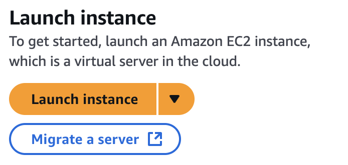
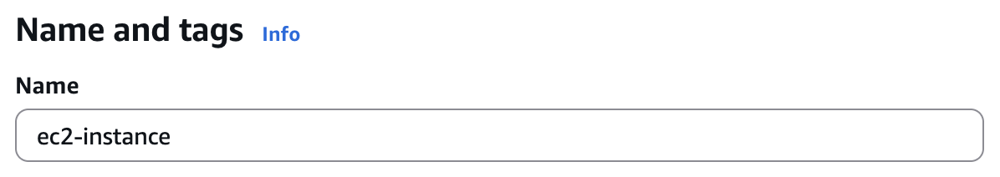
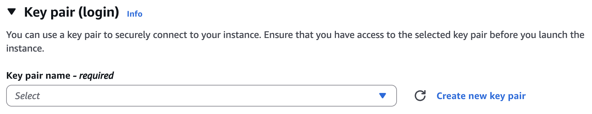
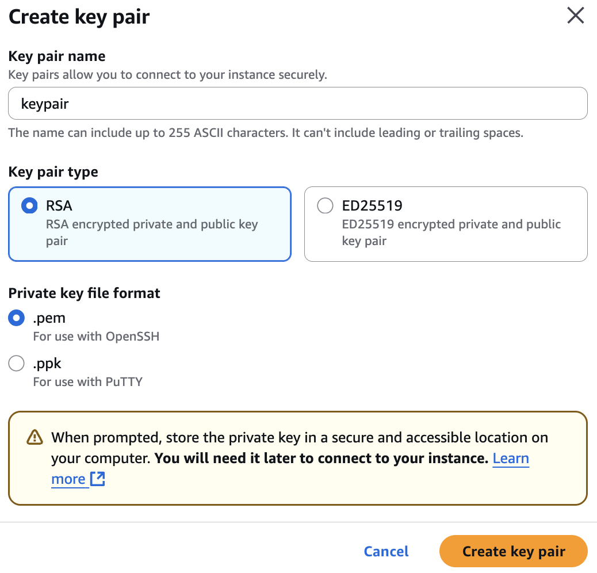
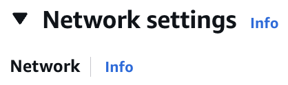
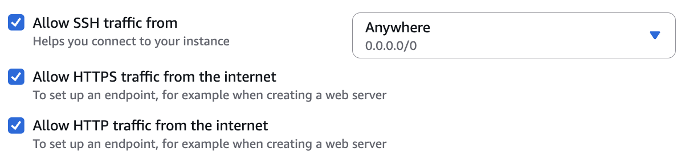
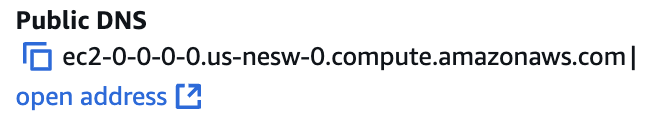

# ec2rds-quickstart
# TLDR :rabbit:
## EC2 Steps :ladder:
Launch instance :arrow_right: Set name to __ec2-instance__ :arrow_right: Set key pair name to __keypair__ :arrow_right: Allow SSH traffic/HTTPS traffic/HTTP traffic :arrow_right: Take note of *Instance ID* :arrow_right: Take note of __Public DNS__
## RDS Steps :ladder:
Create a database :arrow_right: Select __MariaDB__ :arrow_right: Set *DB instance identifier* to __sample__ :arrow_right: Set *Master username* to __admin__ :arrow_right: Create *Master password* :arrow_right: Connect to an EC2 compute resource using the *Instance ID* :arrow_right: Take note of __Endpoint__ 

# Full Length Tutorial
## EC2
<figure>
  <ol start="1"><li><figcaption>Click on <i>Launch instance</i></figcaption></li></ol>
  
</figure>
<figure>
  <ol start="2"><li><figcaption>Under <i>Name</i>, type <b>ec2-instance</b></figcaption></li></ol>
  
</figure>
<figure>
  <ol start="3"><li><figcaption>Under the <i>Key pair (login)</i> section, click on <i>Create new key pair</i></figcaption></li></ol>
  
  <ol start="3"><li><figcaption>In the <i>Key pair name</i> field, type in <b>keypair</b> and then click on <i>Create key pair</i></figcaption></li></ol>
  
</figure>
<figure>
  <ol start="4"><li><figcaption>Look under the <i>Network settings</i> section</figcaption></li></ol>
  
  <ol start="4"><li><figcaption>Tick all the boxes shown below</figcaption></li></ol>
  
</figure>
<figure>
  <ol start="5"><li><figcaption>After launching the instance from the <i>Summary</i> section, you should see the <i>Instance ID</i></figcaption></li></ol>
  <li><figcaption>TIP: THIS WILL BE USEFUL! Write down the <i>Instance ID</i> somewhere, you can use this later (e.g. <i>i-000000000</i>)</figcaption></li>
   
  
</figure>
<figure>
  <ol start="6"><li><figcaption>In the right-most column of the <i>Instance summary</i>, look at the <b>Public DNS</b> section</figcaption></li></ol>
  <li>
    <figcaption>
      THIS IS CRITICAL INFORMATION! Write down the <b>Public DNS</b> somewhere, you will use this a lot! 
       
      (e.g. <b>ec2-0-0-0-0.us-nesw-0.compute.amazonaws.com</b>)
    </figcaption>
  </li>
   
  
</figure>

## Congratulations! :tada:
### You finished creating an EC2 instance! :white_check_mark:
